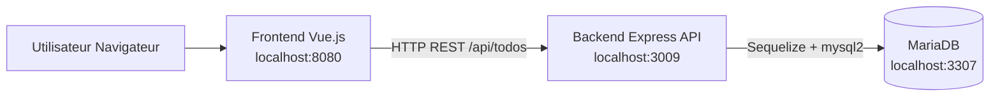

# Schema d'architecture d'execution

## Flux principal

1. Le navigateur charge le frontend Vue.js.
2. Le frontend appelle le backend sur l'URL API configuree.
3. Le backend execute les operations CRUD sur MariaDB.
4. Le backend renvoie une reponse JSON au frontend.
